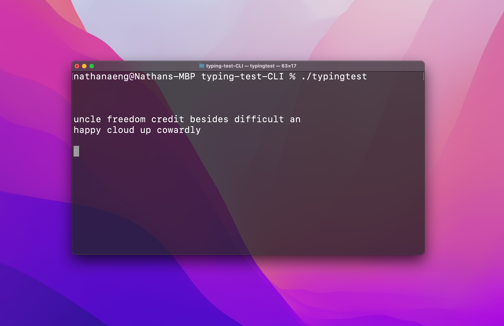

# Typing Test in C
See the newest version, implemented in JavaScript and HTML/CSS [here](https://github.com/nathanaeng/typing-test).

Over the summer, I made it my goal to learn how to type faster. There are lots of great websites out there (like [10fastfingers](https://10fastfingers.com/), [typingtest.com](https://www.typingtest.com/), and [typings.gg](https://typings.gg/)), but I figured I might as well practice coding at the same time - so I implemented a typing test in C! Find out how many words per minute you can type!

----

VERSIONS:
--
The root folder contains a universal Makefile, and the most recent build of 'typingtest.c', which was developed on a Mac running MacOS Monterey (and thus is only guaranteed to be compatible with systems running MacOS). 

Due to how different OSs handle printing to the terminal, multiple versions had to be developed. These versions are fundamentally identical, with only a couple of minor changes. For more documentation, see the section at the bottom of this page. There are 3 subfolders for different compatible operating systems: MacOS, Windows, and Linux (Ubuntu). These folders contain the most stable builds for each OS. Each folder contains a Makefile and the relevant 'typingtest.c' file for the respective OS. 
- Folder 'macos' contains the relevant 'typingtest.c' file for MacOS machines. This version was tested with MacOS Big Sur and MacOS Monterey.
- Folder 'windows' contains the relevant 'typingtest.c' file for Windows machines. This version was tested with Windows 10.
- Folder 'ubuntu' contains the relevant 'typingtest.c' file for Linux (Ubuntu) machines. This version was tested in a virtual machine running Ubuntu (ver. 20.04) and should therefore work in native Ubuntu systems. More Linux distributions may be tested in the future. This folder also contains a file named 'typingtestwsl2.c' - a version compatible with a Windows Terminal environment running Ubuntu (ver. 20.04). Since WSL2 is not quite native Ubuntu, `stty raw` works slightly different (closer to MacOS and Windows versions).

----
### Usage:

Compile typingtest.c using the provided Makefile with `make`

Run the typing test in the terminal with `./typingtest`

### Technicalities:
The list of words used in this typing test can be configured starting around line 9 in 'typingtest.c' by editing the contents of `char *words[]`. Add a word multiple times to change its weight (to make it appear more often).

Change the value of `int N` in main() to change the number of words in the typing test (in 'typingtest.c'). The higher the value of N, the more accurate your results will be - I may be working on a model in the future which estimates the accuracy of the typing test.

The typing test is terminated automatically if the last word typed is correct. Otherwise, the typing test is terminated with a space character.

Words are case sensitive.

Words typed incorrectly will be not be factored into the WPM calculation.

Accuracy is calculated per word, not per character. Suppose there are 4 words with 20 characters total. Even if you only mistype 1 character, your accuracy will be 75% (3/4) and not 95% (19/20).

If the size of your terminal windows is not large enough, the formatting may look weird. Formatting can be changed by editing `int limit`, which represents the number of characters printed per line. Changing this setting is not recommended. You can also change the scale of your terminal window by pressing `'CMD' + '+'` in MacOS, `'CTRL' + '+'` in Windows, and `'CTRL' + 'Shift' + '+'` in Ubuntu. Note that these shortcuts may not be 100% accurate, but you should be able to find the correct ones online pretty easily.

### Differences Betweeen Versions
In MacOS and Windows, `putchar(c)` is necessary to print the user's input to the terminal.

In Windows, the `conio.h` library is used to get input with `getch()` rather than `getchar()`. Additionally, `'\b'` represents the backspace character rather than `0x7F` (which is used for all other versions). Lastly, `printf(" \b")` is used to delete characters in the terminal rather than `printf("\b \b")` (which is used for all other versions).

In Ubuntu, `printf("\b \b")` is added twice in the code segment which tests if the user pressed the backspace key. These 2 lines are added before checking if `pos > 0` (i.e. the user has not pressed any characters yet - besides the delete key, which does not count). This is necessary because in raw terminal mode, Ubuntu will print `^?` when the delete key is pressed prior to there being any characters, and `^H` when there are characters, which must then be erased.

The WSL2 version under the 'ubuntu' folder is a version that works in the Ubuntu environment running in Windows Terminal. It does not require the 2 extra `printf("\b \b")`. This version is identical to the MacOS version besides the fact that it does not require `putchar(c)`.
